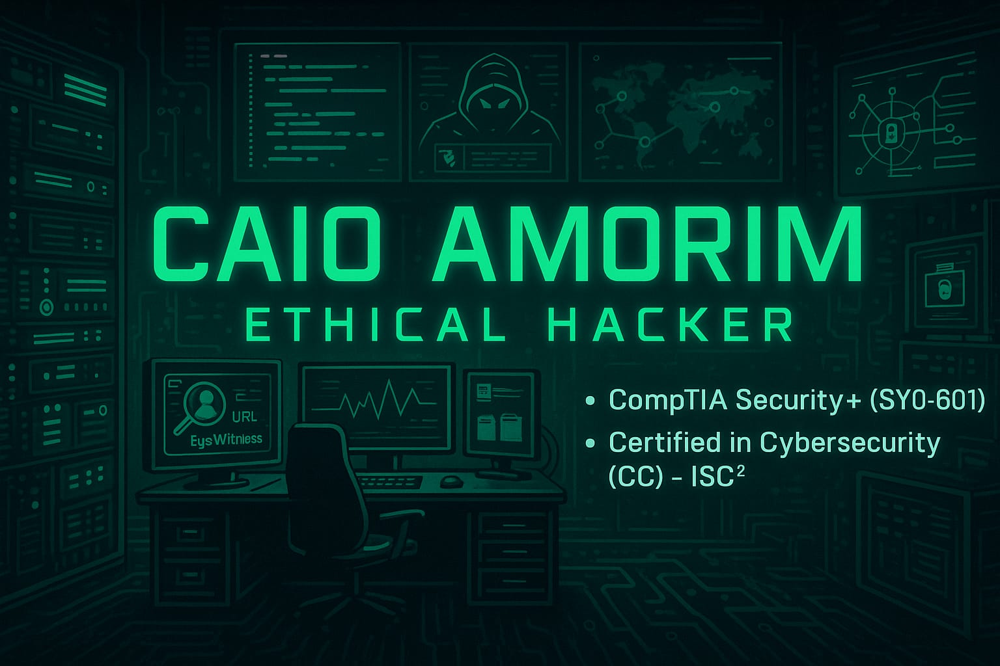

## Hi, I'm Caio Amorim! 👋

  

🎯 Profissional de Cibersegurança especializado em **Hacking Ético**, **Segurança Ofensiva** e **Análise de Vulnerabilidades**.

👨‍💻 Atuo com foco em:
- Pentest de aplicações web, redes e Wi-Fi
- Reconhecimento, enumeração e exploração
- Técnicas de bypass, footprinting e fingerprinting
- Ataques práticos baseados em OWASP Top 10

---

### 🧠 Certificações

- ✅ **CompTIA Security+ (SY0-601)**  
- ✅ **Certified in Cybersecurity (CC) – ISC²**  
- 🎓 Estudante de Ciência da Computação na Dom Helder

---

### 🛠️ Ferramentas & Técnicas

**🔍 Reconhecimento & Enumeração**
- `Google Hacking (dorks)`, `WhatWeb`, `Nmap`, `Gobuster`, `EyeWitness`

**🛡️ Web Hacking**
- `SQL Injection`, `XSS`, `LFI`, `RFI`, `Command Injection`
- `Bypass de autenticação`, `Privilege escalation`, `WAF bypass`

**🎯 Wireless Attacks**
- `Aircrack-ng`, `Airodump-ng`, `Reaver`, `WiFi cracking`, `Fake APs`

**🔑 Quebra de senhas & Cracking**
- `Hydra`, `John the Ripper`, `Hashcat`, `Wordlists customizadas`

**🧠 Fingerprinting & Footprinting**
- Identificação de serviços, SOs, tecnologias, subdomínios e fingerprint de aplicações

**🧰 Outras ferramentas**
- `Burp Suite`, `Metasploit`, `SQLmap`, `Wireshark`, `Netcat`, `Tcpdump`, `Snort`

---

### 📂 Repositórios em destaque

🧰 **[EyeWitness Custom](https://github.com/caio1020ee)**  
Modificações na ferramenta EyeWitness para melhorar automação de screenshots em pentests.

🛠️ **[Scripts de Pentest](https://github.com/caio1020ee)**  
Automação com Bash e Python para reconhecimento, brute force e enumeração.

📁 **[Writeups & Labs](https://github.com/caio1020ee)**  
Análises técnicas e soluções de desafios do Hack The Box, TryHackMe e VulnHub.

---

### 🌐 Onde me encontrar

  
📫 Email: caio.lucas.amorim@outlook.com

---

⭐ Obrigado por visitar meu perfil!  
Atualmente busco oportunidades como **Pentester Júnior**, **Analista de Segurança Ofensiva** ou **Red Teamer em formação**.
